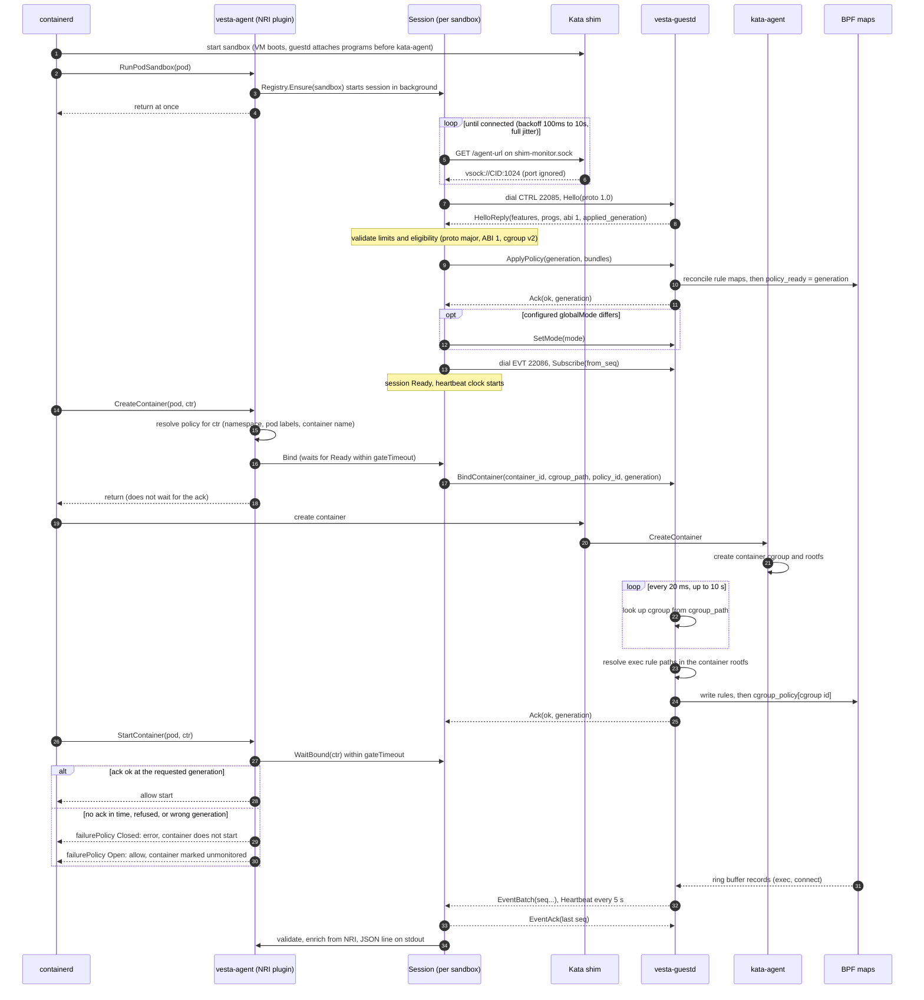

# Components

vesta has five parts. Two run on the Kubernetes node: **vesta-install**, an init container that installs the vesta guest kernel and image and registers the `kata-qemu-vesta` runtime handler, and **vesta-agent**, an NRI plugin that talks to every vesta Kata sandbox. Three run inside each Kata VM: the **guest image** (kernel and rootfs), **vesta-guestd**, a daemon that loads the BPF programs and serves the host over vsock, and the **BPF programs** themselves, which audit exec and connect calls and deny them when a policy says so. This page shows how they work together when a pod starts, as the code implements it today. Each component has its own page below.

> **Status:** this is a draft MVP (Phase 0/1: audit-first, QEMU only). The pieces are unit-tested, but the flow on this page has **not been run end to end in a real Kata 4.2 VM**. The vsock dial, the shim `/agent-url` lookup and guestd under systemd in the real guest have never run. See [Implementation status](../IMPLEMENTATION_STATUS.md).

## Where each component runs

```text
 Kubernetes node (host)                                  Kata VM (guest), one per vesta pod
+-----------------------------------------------+       +------------------------------------------+
| kubelet -> containerd 2.x                      |       | systemd                                  |
|              |  NRI (/var/run/nri/nri.sock)    |       |   vesta-guestd.service  (Before=)        |
|              v                                 |       |   kata-agent.service    (After=, Wants=) |
|  vesta-agent (DaemonSet, hostNetwork)          | vsock |                                          |
|    NRI plugin "vesta", index 90                |<----->|  vesta-guestd                            |
|    one Session per vesta sandbox               | CTRL  |    CTRL server  port 22085               |
|    JSON-lines events on stdout                 | 22085 |    EVT server   port 22086               |
|    /metrics /healthz /readyz (127.0.0.1:9464)  | EVT   |    policy engine, replay buffer          |
|                                                | 22086 |        |  map writes   ^ ring buffer    |
|  containerd-shim-kata-v2 (runtime-rs)          |       |        v               |                 |
|    shim-monitor.sock  GET /agent-url           |       |  BPF: P1 exec audit, P2 exec LSM,        |
|                                                |       |       N1 connect4/connect6               |
|  vesta-install (init container)                |       |                                          |
|    /opt/vesta/kata/<version>/ + containerd     |       |  kata-agent creates container cgroups   |
|    drop-in + node label vesta.dev/guest-ready  |       |  and rootfs /run/kata-containers/<cid>/ |
+-----------------------------------------------+       +------------------------------------------+
```

| Component | Language | Source | Page |
|---|---|---|---|
| vesta-agent | Go | [`host/cmd/vesta-agent`]({{ site.vesta_repo_url }}/blob/main/host/cmd/vesta-agent/main.go), [`host/internal`]({{ site.vesta_repo_url }}/blob/main/host/internal/README.md) | [vesta-agent](vesta-agent.md) |
| vesta-install | Go | [`host/cmd/vesta-install`]({{ site.vesta_repo_url }}/blob/main/host/cmd/vesta-install/main.go), [`host/internal/install`]({{ site.vesta_repo_url }}/blob/main/host/internal/install/install.go) | [vesta-install](vesta-install.md) |
| vesta-guestd | Rust | [`guest/vesta-guestd`]({{ site.vesta_repo_url }}/blob/main/guest/vesta-guestd/src/main.rs) | [vesta-guestd](vesta-guestd.md) |
| BPF programs | C (CO-RE) | [`bpf/vesta.bpf.c`]({{ site.vesta_repo_url }}/blob/main/bpf/vesta.bpf.c) | [BPF programs](bpf-programs.md) |
| Guest image | shell, Kata tooling | [`images/guest`]({{ site.vesta_repo_url }}/blob/main/images/guest/README.md) | [Guest image](guest-image.md) |

## Before any pod: node installation and guest boot

1. The chart's DaemonSet runs on nodes labelled `katacontainers.io/kata-runtime: "true"`. Its init container, vesta-install, copies `vmlinux-vesta` and `vesta-guest.img` to `/opt/vesta/kata/<version>/`, generates the runtime config, writes a containerd drop-in for the `kata-qemu-vesta` handler, restarts containerd if the drop-in changed, and labels the node `vesta.dev/guest-ready=<version>`. The RuntimeClass `kata-qemu-vesta` selects on that label. See [vesta-install](vesta-install.md).
2. vesta-agent starts, loads its config and optional static policy file, and registers with containerd as NRI plugin `vesta` (index `90`). `/readyz` answers 200 only while the plugin is registered.
3. When a pod with `runtimeClassName: kata-qemu-vesta` is scheduled, containerd starts the Kata runtime-rs shim, which boots QEMU with the vesta kernel and image. Inside the guest, systemd starts `vesta-guestd.service` **before** `kata-agent.service`. guestd loads and attaches the BPF programs, then signals `READY=1`, and only then does kata-agent start. If guestd fails, kata-agent still starts after at most `TimeoutStartSec=10s` (fail-open at boot). See [Guest image](guest-image.md) and [vesta-guestd](vesta-guestd.md).

## Pod start sequence

The diagram follows one pod with one container. The NRI hooks are serialized node-wide by containerd, and every vesta wait inside a hook is bounded by `gateTimeout` (default 1.5 s, which must stay below containerd's 2 s NRI request timeout).



What happens at each step, as implemented:

| Step | Where | Behaviour |
|---|---|---|
| RunPodSandbox | `nriplugin.Plugin.RunPodSandbox` | Returns at once for pods whose runtime handler is not in `handlers`. For vesta pods it creates the session, which connects in the background. An invalid sandbox ID means the pod is not monitored. |
| Endpoint discovery | `transport.ShimClient.AgentEndpoint` | Looks for `shim-monitor.sock` under `/run/kata/<id>/`, then `/run/vc/sbs/<id>/`, and sends `GET /agent-url` (1 s timeout). `vsock://<cid>:<port>` and `hvsock://<path>:<port>` are accepted. The port is kata-agent's and is ignored. An empty body or a non-200 answer means "not ready yet", and the session retries. |
| Hello | `sandbox.Session.handshake` | CTRL is dialled fresh for each supported protocol major (only `1` today). The reply is length- and enum-checked. A guest with a different protocol major, a BPF ABI other than `1`, or no cgroup v2 is **ineligible**: the session stops, and binds fail. |
| ApplyPolicy | `Session.applyPolicy` | Sends the whole compiled policy set. The generation comes from the wall clock at agent start (Unix ms). If the guest already applied a higher generation, the agent sends that plus one. If the guest refuses, containers that have a policy fall back to their failure policy. |
| CreateContainer | `Plugin.CreateContainer`, `Session.Bind` | Resolves the policy, waits for the session to be ready, checks the policy is usable (an `Enforce` policy needs guest features `enforce` and `bpf_lsm`), and sends `BindContainer` with the session's applied generation. It does **not** wait for the ack, because kata-agent creates the cgroup only after this hook returns. |
| cgroup wait | `ctrl::wait_for_cgroup` and `cgwatch` in guestd | Woken by an inotify watch that follows the pending cgroup path down the tree, for up to `bind_timeout_ms` (10 s), with a fallback re-check every `bind_poll_ms` (100 ms). |
| StartContainer | `Plugin.StartContainer`, `Session.WaitBound` | The **start gate**. Waits up to `gateTimeout` for the bind ack. The ack must be `ok` and carry the generation the bind asked for. A bind that is only pending on the guest (its generation is not applied yet) is acked with the applied generation, so the gate does not count it as confirmed. |
| Events | guestd `evt`, agent `Session.streamEvents` | guestd streams batches from its replay buffer and a heartbeat every `heartbeat_interval_ms` (5 s). The agent validates each event, enriches it from NRI data, exports it as a JSON line and acks the batch. |

### Failure behaviour

- **`failurePolicy: Closed`** makes the gate return an error from `CreateContainer` or `StartContainer`, so containerd fails the CRI call and kubelet retries. **`Open`** (the default, and `defaultFailurePolicy` for containers no policy selects) lets the container run; it is counted as `unmonitored` in `vesta_gate_decisions_total`.
- **Sandbox default.** Besides the host start gate, the host sends `SetSandboxDefault` with the pod's cgroup parent on every connect. When any policy selecting the pod is `Enforce` with `failurePolicy: Closed`, guestd writes a pending `Closed`/`Enforce` `cgroup_policy` entry (policy id 0) on the pod-level cgroup. The BPF ancestor lookup applies it to every container cgroup in the pod that is not bound, so exec and connect there are denied until its bind completes; a bound container's own entry is nearer and wins. Otherwise the host sends `Open`, which removes the entry. The default covers the whole pod: a container whose own policy is `Open` but whose bind does not complete is denied too.
- **NRI skips unregistered plugins.** While vesta-agent is not registered (a rollout, a crash, a containerd restart), containerd starts vesta containers without asking it. vesta-install enables containerd's NRI default validator, so a pod annotated `required-plugins.noderesource.dev/pod: '["vesta"]'` cannot create containers until the plugin is back. The chart can require that annotation (`nri.requirePluginAnnotation`). See [vesta-agent](vesta-agent.md#nri-registration-and-the-required-plugins-annotation).
- **Programs keep enforcing without guestd.** Links are pinned in bpffs, so a guestd crash or `SIGTERM` does not detach them. The host notices the missing heartbeat.

## Container removal and agent restarts

- `RemoveContainer` sends `Unbind` in the background (bounded by the 5 s request timeout). `StopPodSandbox` and `RemovePodSandbox` stop the session asynchronously, so a guest cannot stall the hook.
- guestd also garbage-collects bindings whose cgroup has disappeared, every `gc_interval_ms` (30 s).
- When the NRI connection comes back (agent or containerd restart), `Synchronize` rebuilds the session registry from containerd's view and re-binds running containers in the background (30 s timeout each). Those containers are already running, so they are not gated.
- When a session reconnects to the same guest, it re-sends `ApplyPolicy`, re-binds every known container, and resumes the event stream from the last received seq.

## Related pages

- [Implementation status](../IMPLEMENTATION_STATUS.md): what is built, deviations from the design, and what has not run.
- [Design](../ARCHITECTURE.md): the target architecture. Parts of it are not implemented.
- [BPF ABI](../abi.md): map and record layouts shared by the BPF programs and guestd.
- [Security](../security.md): trust boundaries and threat model notes.
