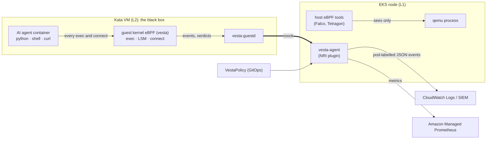

# AWS EKS reference architecture: sandboxed agents with Kata and vesta

This page shows how to run untrusted workloads, such as AI agents that execute model-generated code, on Amazon EKS. Each pod runs in its own Kata Containers VM, on Karpenter-provisioned EC2 nodes with nested virtualization. vesta runs eBPF inside every one of those VMs, so you can see and control what the sandboxed code actually does.
{: .fs-5 .fw-300 }

{: .warning }
> This is a reference design. vesta is a pre-release, and it has not run on EKS or anywhere else end to end yet (see [Status](../IMPLEMENTATION_STATUS.md)). The EKS, Karpenter and kata-deploy settings below follow those projects' documented APIs: Karpenter v1.14 `EC2NodeClass.spec.cpuOptions` and the kata-deploy 4.2 Helm chart. Validate them in a test account first.


## Why Kata Containers for sandboxed agents

An AI agent that writes and runs code is untrusted code by design. It installs packages, runs shell commands, opens network connections, and it can be steered by prompt injection. In a regular container (runc), all of that runs directly on the node's kernel, shared with every other pod on the node. One kernel bug is enough to escape to the node.

Kata Containers runs each pod in a lightweight VM with its **own guest kernel**:

| | runc container | Kata Containers pod |
|---|---|---|
| Kernel | shared with the node and every other pod | a dedicated guest kernel per pod |
| Isolation boundary | namespaces, cgroups, seccomp | hardware virtualization (KVM), plus the same in-guest controls |
| A kernel exploit reaches | the node, and every pod on it | that pod's VM |
| Image and API compatibility | OCI images, Kubernetes pods | the same: select it with `runtimeClassName` |
| Cost | none | about 250 MiB of memory per pod, and VM boot time |

On AWS, Kata needs KVM inside the EC2 instance. Until recently that meant bare-metal (`*.metal`) instances. EC2 now supports **nested virtualization** on regular virtual instances: the Nitro hypervisor is L0, the node runs KVM at L1, and each Kata VM is L2. The Karpenter `EC2NodeClass` turns this on with `cpuOptions.nestedVirtualization: enabled` and then only launches instance types whose `DescribeInstanceTypes` output lists `nested-virtualization`. AWS's examples use the 8th-generation Intel families (for example `m8i`, `r8i`). Check what your region offers:

```sh
aws ec2 describe-instance-types \
  --filters Name=processor-info.supported-features,Values=nested-virtualization \
  --query 'InstanceTypes[].InstanceType' --output text
```

## The black box, and how vesta looks inside

Kata's isolation has a cost for security teams: **the VM is a black box**. Host-level eBPF tools (Falco, Tetragon, Tracee) attach to the node's kernel. From there, a Kata pod is one `qemu` process. The agent's `exec` of a downloaded binary, its reverse shell, or its connection to an unexpected endpoint all happen in the guest kernel, where those tools cannot see them.

vesta moves the eBPF programs into the guest kernel of every Kata pod:



What vesta gives you for each sandbox:

- **Visibility.** Every successful `exec` in the sandbox: path, argv, user, parent chain, container. Every outbound `connect`: address, port, protocol. vesta-agent adds the Kubernetes pod, namespace and container names on the host, so a guest cannot forge them.
- **Enforcement inside the VM.** A `VestaPolicy` can allow or deny executables (for example, only `python3` and the agent's tools), and deny egress by CIDR and port. Decisions run in the guest kernel's BPF LSM and cgroup hooks, so they keep working if the guest daemon or the channel is down.
- **Start gating.** With `failurePolicy: Closed`, a container does not start until its guest confirms the policy is in force. A pod-wide default denies exec and connect in any container of the pod that is not bound yet.
- **Audit first.** Start in `mode: Audit`: denials are reported as `would_deny` but not enforced. Once the event stream shows what your agents really do, switch to `Enforce` without restarting pods (policies are hot-reloaded).
- **Tamper evidence.** Heartbeats carry program tags and link ids. The agent alerts when a guest stops reporting or its programs change.

A denied exec, as vesta-agent exports it (illustrative values):

```json
{
  "timestamp": "2026-09-30T12:04:11.482Z",
  "severity_text": "WARN",
  "event_name": "vesta.exec",
  "attributes": {
    "k8s.namespace.name": "agents",
    "k8s.pod.name": "agent-7f9c",
    "k8s.container.name": "sandbox",
    "vesta.runtime_handler": "kata-qemu-vesta",
    "vesta.event.type": "exec",
    "vesta.action": "denied",
    "vesta.policy.name": "agent-sandbox",
    "process.executable.path": "/tmp/x",
    "process.command": "x"
  }
}
```

## How the pieces fit

1. **VPC.** Nodes run in private subnets across three Availability Zones. Egress goes through NAT gateways, or through VPC endpoints for AWS APIs. Keep the sandboxes' egress narrow here too (security groups for pods, network policy), as defense in depth to vesta's in-guest rules.
2. **EKS control plane.** It stores the `VestaPolicy` CRD objects and the `kata-qemu-vesta` RuntimeClass. Policies come from GitOps.
3. **System node group.** A small managed node group, which needs no nested virtualization, runs Karpenter, CoreDNS and the CNI.
4. **Karpenter.** The `kata` EC2NodeClass enables nested virtualization. The `sandboxed-agents` NodePool restricts instance families, taints its nodes so only sandbox pods land there, and adds a startup taint that kata-deploy removes once Kata is installed.
5. **Kata node.** kata-deploy installs Kata 4.2 (QEMU, runtime-rs). The vesta DaemonSet's init container, vesta-install, adds the vesta guest kernel and image and registers the `kata-qemu-vesta` handler. vesta-agent then runs as an NRI plugin.
6. **Sandbox pods.** They set `runtimeClassName: kata-qemu-vesta`. Each gets its own VM, where vesta-guestd has already attached the BPF programs before the container starts.
7. **Observability.** vesta-agent writes events as JSON lines to stdout (collected by Fluent Bit into CloudWatch Logs or a SIEM) and serves Prometheus metrics (scraped into Amazon Managed Service for Prometheus).

## Configuration

### Karpenter: EC2NodeClass and NodePool

```yaml
apiVersion: karpenter.k8s.aws/v1
kind: EC2NodeClass
metadata:
  name: kata
spec:
  role: KarpenterNodeRole-my-cluster
  amiSelectorTerms:
    - alias: al2023@latest
  subnetSelectorTerms:
    - tags: {karpenter.sh/discovery: my-cluster}
  securityGroupSelectorTerms:
    - tags: {karpenter.sh/discovery: my-cluster}
  # L1 KVM for Kata's per-pod VMs. Karpenter only picks instance types that
  # report nested-virtualization support.
  cpuOptions:
    nestedVirtualization: enabled
  # Sandboxes must not reach the node's instance metadata credentials.
  metadataOptions:
    httpTokens: required
    httpPutResponseHopLimit: 1
  blockDeviceMappings:
    - deviceName: /dev/xvda
      ebs: {volumeSize: 100Gi, volumeType: gp3, encrypted: true}
---
apiVersion: karpenter.sh/v1
kind: NodePool
metadata:
  name: sandboxed-agents
spec:
  template:
    metadata:
      labels:
        workload: sandboxed-agents
        # Karpenter only launches a node for a pending pod if the NodePool's
        # labels satisfy the pod. The kata-qemu-vesta RuntimeClass selects on
        # these, which kata-deploy and vesta-install set later anyway.
        katacontainers.io/kata-runtime: "true"
        vesta.dev/guest-ready: "0.1.0"
    spec:
      nodeClassRef: {group: karpenter.k8s.aws, kind: EC2NodeClass, name: kata}
      taints:
        - {key: sandboxed, value: "true", effect: NoSchedule}
      # Removed by kata-deploy once the Kata runtime is installed.
      startupTaints:
        - {key: katacontainers.io/kata-runtime, effect: NoSchedule}
      requirements:
        - {key: kubernetes.io/arch, operator: In, values: [amd64]}
        - {key: karpenter.k8s.aws/instance-family, operator: In, values: [c8i, m8i, r8i]}
        - {key: karpenter.sh/capacity-type, operator: In, values: [on-demand]}
  disruption:
    # Agents may run long tasks; consolidate only empty nodes.
    consolidationPolicy: WhenEmpty
    consolidateAfter: 10m
  limits:
    cpu: "512"
```

### kata-deploy

```yaml
# helm install kata-deploy oci://ghcr.io/kata-containers/kata-deploy-charts/kata-deploy \
#   --version 4.2.0 -n kube-system -f kata-deploy-values.yaml
k8sDistribution: k8s
nodeSelector:
  workload: sandboxed-agents
tolerations:
  - {key: sandboxed, operator: Exists, effect: NoSchedule}
  - {key: katacontainers.io/kata-runtime, operator: Exists, effect: NoSchedule}
startupTaints:
  - "katacontainers.io/kata-runtime:NoSchedule"
shims:
  disableAll: true
  qemu-runtime-rs:
    enabled: true
```

### vesta

```yaml
# helm install vesta deploy/helm/vesta -n vesta-system --create-namespace -f vesta-values.yaml
guestVersion: "0.1.0"
tolerations:
  - {key: sandboxed, operator: Exists, effect: NoSchedule}
runtimeClass:
  # Added to every pod that uses kata-qemu-vesta.
  tolerations:
    - {key: sandboxed, operator: Exists, effect: NoSchedule}
policies:
  source: kubernetes
nri:
  requirePluginAnnotation: true
priorityClassName: system-node-critical
```

`nri.requirePluginAnnotation` adds an admission policy that rejects `kata-qemu-vesta` pods without the NRI required-plugins annotation (`required-plugins.noderesource.dev/pod: '["vesta"]'`, as in the pod below). With it, containerd refuses to create their containers while vesta-agent is down, so a `failurePolicy: Closed` policy cannot be bypassed by an agent restart. See the chart README's `failurePolicy: Closed` section.

### A sandboxed agent and its policy

```yaml
apiVersion: v1
kind: Pod
metadata:
  name: agent-7f9c
  namespace: agents
  labels: {app: coding-agent}
  annotations:
    required-plugins.noderesource.dev/pod: '["vesta"]'
    karpenter.sh/do-not-disrupt: "true"
spec:
  runtimeClassName: kata-qemu-vesta
  automountServiceAccountToken: false
  containers:
    - name: sandbox
      image: 123456789012.dkr.ecr.eu-west-1.amazonaws.com/coding-agent:1.4
---
apiVersion: vesta.dev/v1alpha1
kind: VestaPolicy
metadata:
  name: agent-sandbox
  namespace: agents
spec:
  selector: {matchLabels: {app: coding-agent}}
  mode: Audit            # observe first; switch to Enforce when the events look right
  failurePolicy: Closed  # no container starts before its policy is in force
  process:
    allow:
      - {path: /usr/local/bin/python3}
      - {path: /usr/bin/git}
      - {path: /bin/sh}
  network:
    egressDefault: Deny
    egress:
      - {cidr: 10.0.0.0/16, ports: [443], protocol: TCP}   # VPC endpoints, internal APIs
      - {cidr: 172.20.0.10/32, ports: [53], protocol: UDP} # cluster DNS
```

Check that the policy is in force on each node:

```sh
kubectl -n agents get vpol agent-sandbox \
  -o jsonpath='{range .status.nodes[*]}{.node}: accepted={.accepted} sandboxes={.sandboxes} programmed={.programmed}{"\n"}{end}'
```

## Limitations to plan for

- **Pre-release.** vesta has not run on EKS. Its end-to-end suite (`test/e2e/`, k3s + Cilium + Kata) needs a host with `/dev/kvm` and has not run yet either.
- **Startup race for the vesta handler.** kata-deploy removes the Karpenter startup taint once Kata is installed, which can be before vesta-install has registered `kata-qemu-vesta`. A sandbox pod scheduled in that window fails sandbox creation until the handler exists, and the kubelet retries it. vesta-install does not yet remove a startup taint of its own.
- **Nested virtualization overhead.** L2 VMs pay for extra exits into L0. Benchmark agent workloads (package installs, compilers) before sizing, and prefer `WhenEmpty` consolidation so running sandboxes are not moved.
- **Egress rules see the dialed address.** vesta's connect hooks run before Service translation, so rules on a Service's ClusterIP match connects to that ClusterIP. FQDN rules are not supported; use CIDRs, or pair vesta with an egress proxy.
- **Kernel.** vesta ships its own guest kernel, built with BPF LSM and BTF. The node's AL2023 kernel only needs KVM and `vhost_vsock`.
