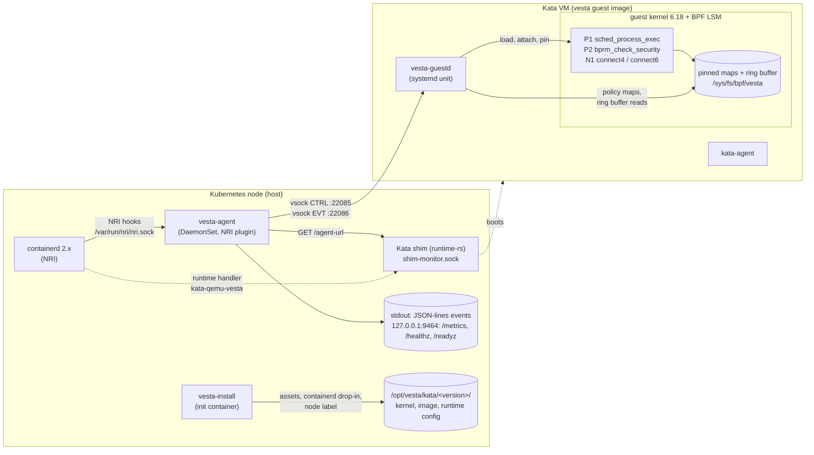

# vesta

vesta runs eBPF programs inside the guest kernel of each Kata Containers pod. It audits process execution and outbound connections there and can block them. A node agent on the host (`vesta-agent`) talks to a daemon in each guest (`vesta-guestd`) over vsock. It gates container start on the guest confirming that a container's policy is in place, and it writes the guest's events as JSON lines. This site describes the code as it is today, a pre-release (`0.1.0-dev`), and not the full design.
{: .fs-5 .fw-300 }

{: .warning }
> vesta is a draft MVP (roadmap Phase 0/1, audit first, QEMU only). The components build and pass their unit tests, and the BPF programs pass a privileged smoke test on a Docker host kernel. **Nothing has run end to end inside a Kata VM yet.** See [Implementation status](IMPLEMENTATION_STATUS.md) before you deploy it anywhere.

## Why eBPF in the guest kernel

A Kata pod runs its containers inside a lightweight VM with its own Linux kernel. eBPF tools on the host see the VMM process (QEMU), not the processes, files and sockets inside the VM. The container's system calls happen in the guest kernel, so that is where vesta attaches its programs:

- **P1 exec audit:** `tp_btf/sched_process_exec` records every exec with path, argv, credentials and the container's cgroup.
- **P2 exec control:** `lsm/bprm_check_security` (BPF LSM) allows or denies an exec by the executable's `(dev, ino)`.
- **N1 egress control:** `cgroup/connect4` and `cgroup/connect6` allow or deny outbound connects by CIDR, port and protocol.

Each event is tied to the container through its guest cgroup (cgroup v2). The host adds Kubernetes metadata that it gets from NRI, never from the guest. Everything the guest reports is treated as untrusted input.

## Components as implemented



- **vesta-install** runs as an init container of the agent DaemonSet. It copies the vesta guest kernel and image to `/opt/vesta/kata/<version>/`, generates a Kata runtime config from the node's own `qemu-runtime-rs` config, registers the `kata-qemu-vesta` containerd runtime handler, restarts containerd, and labels the node `vesta.dev/guest-ready=<version>`.
- **vesta-agent** is an NRI plugin. For pods whose runtime handler is `kata-qemu-vesta` it finds the guest's vsock address through the Kata shim, opens a CTRL and an EVT connection to vesta-guestd, sends the compiled policy, binds each container's cgroup to its policy, and holds `StartContainer` until the guest acknowledges the bind. It exports guest events and Prometheus metrics.
- **vesta-guestd** starts before kata-agent in the guest. It loads and pins the BPF programs, keeps the policy maps up to date, reads the ring buffer, and serves the host channel. It sends a heartbeat every 5 s by default.
- **The BPF programs** make the allow/deny decision in the kernel, so enforcement does not depend on event delivery or on guestd staying up.

Component details: [Components](components/index.md). Wire formats and limits: [Reference](reference/index.md).

## Current status

| Area | State in this tree |
|---|---|
| BPF programs P1, P2, N1 (`bpf/`) | Implemented. Build for x86_64 and arm64. Smoke-tested on a 7.0 Docker Desktop kernel, not yet on the vesta 6.18 guest kernel |
| `vesta-guestd` (`guest/`) | Implemented: load/attach/pin, policy maps, container binding, CTRL/EVT channel, heartbeats, replay buffer. x86_64 build only |
| `vesta-agent` (`host/cmd/vesta-agent`) | Implemented: NRI plugin with start gate, per-sandbox sessions over vsock, JSON-lines export, Prometheus metrics. Static policy file only |
| `vesta-install` (`host/cmd/vesta-install`) | Implemented: guest assets with SHA-256 checks, runtime config, containerd drop-in with rollback, node label, uninstall |
| Guest kernel and rootfs recipe (`images/guest/`) | Kernel fragment merge checked with Kata's `build-kernel.sh`. Full kernel and osbuilder image builds not run yet |
| Helm chart (`deploy/helm/vesta`) | Lints and validates against the Kubernetes 1.34 schemas |
| Policy CRDs, OTLP export, self-protection, file/DNS/syscall hooks | Not implemented yet |

The full list, including deviations from the design, is in [Implementation status](IMPLEMENTATION_STATUS.md).

## Where to go next

| If you want to | Read |
|---|---|
| Know what a node needs and what vesta changes on it | [Getting Started](getting-started/index.md) |
| Build the binaries, BPF objects, guest kernel, guest image and container images | [Building](getting-started/building.md) |
| Install the chart and run a pod under vesta | [Deploying](getting-started/deploying.md) |
| Run sandboxed AI agents on Amazon EKS with Karpenter, Kata and vesta | [AWS EKS reference architecture](getting-started/aws-eks.md) |
| Review threats, mitigations and open security risks | [Threat model (STRIDE)](threat-model.md) |
| Set agent flags, write a policy file, tune the guest daemon | [Configuration](getting-started/configuration.md) |
| Read events and metrics, use the kill switch, troubleshoot | [Operations](getting-started/operations.md) |
| Understand each component's internals | [Components](components/index.md) |
| Look up the channel protocol, BPF ABI and event schema | [Reference](reference/index.md) |
| Review the trust boundaries and privileges | [Security](security.md) |
| Run the tests | [Testing](testing.md) |
| Read the full design, including parts not built yet | [Design](design/index.md) |

## Preview the docs locally

The site is built by GitHub Pages from the `docs/` folder on `main`, using Jekyll with the just-the-docs remote theme. To preview it with the same gem set:

```sh
cd docs
bundle install
bundle exec jekyll serve --livereload
# open http://127.0.0.1:4000/
```

This needs Ruby 3.x and Bundler. [`docs/Gemfile`]({{ site.vesta_repo_url }}/blob/main/docs/Gemfile) pulls the `github-pages` gem, which pins Jekyll and the plugins listed in [`docs/_config.yml`]({{ site.vesta_repo_url }}/blob/main/docs/_config.yml).
