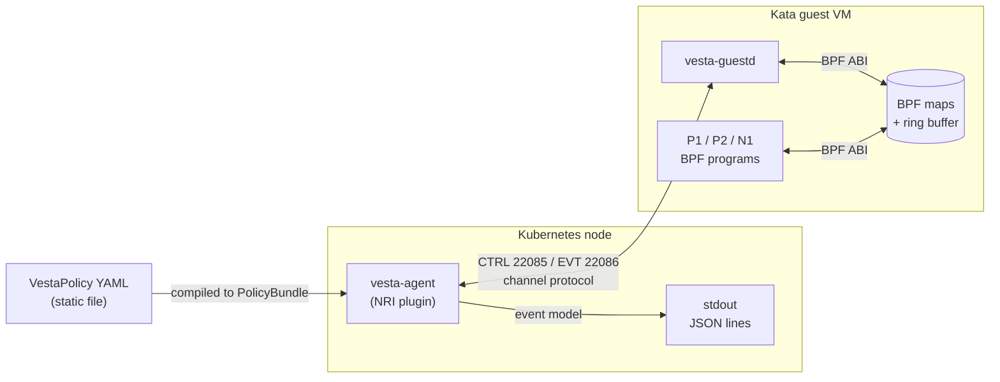

# Reference

These pages describe the contracts vesta's components share, as the code implements them today. Each page names the source files it was written from; when the page and the code disagree, the code is right, and the page is a bug.

| Page | Contract | Source of truth |
|---|---|---|
| [Channel protocol](protocol.md) | Host-guest CTRL and EVT connections over vsock: framing, handshake, messages, limits, errors | [`api/proto/vesta/channel/v1/`]({{ site.vesta_repo_url }}/tree/main/api/proto/vesta/channel/v1), [`api/channel/constants.go`]({{ site.vesta_repo_url }}/blob/main/api/channel/constants.go) |
| [Events](events.md) | The `vesta.event.v1.Event` model and the JSON-lines records `vesta-agent` writes | [`api/proto/vesta/event/v1/event.proto`]({{ site.vesta_repo_url }}/blob/main/api/proto/vesta/event/v1/event.proto), [`host/internal/events/`]({{ site.vesta_repo_url }}/tree/main/host/internal/events) |
| [Policy](policy.md) | The `vesta.dev/v1alpha1` `VestaPolicy` schema, its validation, and how it compiles into `PolicyBundle` | [`api/v1alpha1/types.go`]({{ site.vesta_repo_url }}/blob/main/api/v1alpha1/types.go), [`host/internal/policy/policy.go`]({{ site.vesta_repo_url }}/blob/main/host/internal/policy/policy.go) |
| [BPF ABI](../abi.md) | Map layouts, ring buffer records and decision logic shared by the BPF programs and `vesta-guestd` | [`bpf/include/vesta_abi.h`]({{ site.vesta_repo_url }}/blob/main/bpf/include/vesta_abi.h) |
| [Kata 4.2 compatibility](../compat/kata-4.2.md) | Upstream facts vesta relies on (Kata 4.2.0, containerd 2.4.1, NRI v0.12.3), each with a source link | Upstream source trees |

## How the contracts fit together

- **Policy → protocol.** `vesta-agent` compiles the policy file into `PolicyBundle` messages and sends them in `ApplyPolicy` on the CTRL connection.
- **Protocol → ABI.** `vesta-guestd` validates each bundle again, resolves exec paths inside each container's rootfs, and writes the result into the BPF maps described in the ABI.
- **ABI → events.** The BPF programs write fixed-size records to the ring buffer. `vesta-guestd` turns them into `vesta.event.v1.Event` messages and streams them over EVT. `vesta-agent` validates and enriches them, then writes JSON lines.

{: .note }
vesta is a draft MVP (roadmap Phase 0/1, with parts of Phases 2 and 3). The contracts on these pages are implemented and unit-tested, but have not run end to end inside a real Kata VM. See [Status](../IMPLEMENTATION_STATUS.md).
