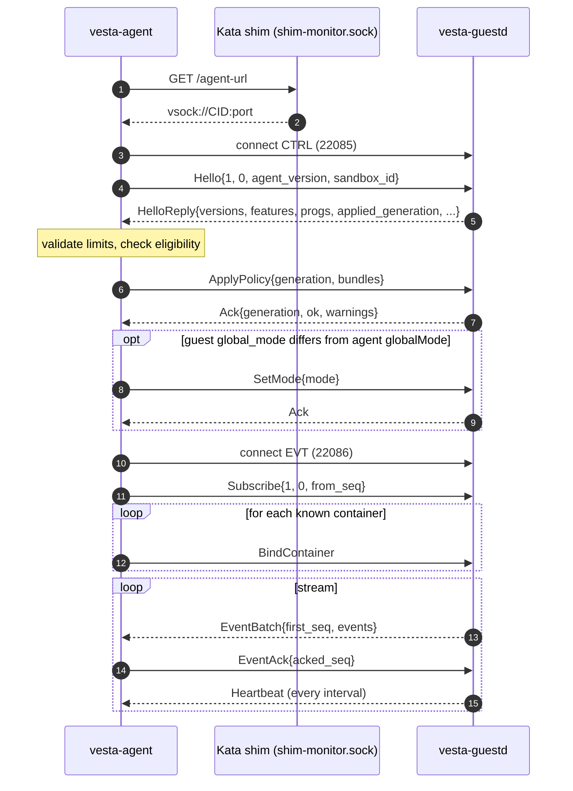

# Channel protocol (version 1.0)
{: .no_toc }

`vesta-agent` on the node and `vesta-guestd` inside each Kata guest talk over two vsock connections per sandbox: **CTRL** carries requests from the host (handshake, policy, container binds, kill switch) and their responses; **EVT** carries the guest's event stream and heartbeats, plus the host's acknowledgements. Both use the same length-prefixed protobuf framing. This page documents protocol 1.0 as defined in [`api/proto/vesta/channel/v1/`]({{ site.vesta_repo_url }}/tree/main/api/proto/vesta/channel/v1) and as implemented by the guest ([`guest/vesta-guestd/src/ctrl.rs`]({{ site.vesta_repo_url }}/blob/main/guest/vesta-guestd/src/ctrl.rs), [`evt.rs`]({{ site.vesta_repo_url }}/blob/main/guest/vesta-guestd/src/evt.rs), [`codec.rs`]({{ site.vesta_repo_url }}/blob/main/guest/vesta-guestd/src/codec.rs)) and the host ([`host/internal/sandbox/`]({{ site.vesta_repo_url }}/tree/main/host/internal/sandbox), [`host/internal/wire/`]({{ site.vesta_repo_url }}/tree/main/host/internal/wire), [`host/internal/transport/`]({{ site.vesta_repo_url }}/tree/main/host/internal/transport)).

{: .warning }
Both ends are unit-tested against each other's message shapes, but the vsock dial, the `/agent-url` endpoint discovery and the hybrid-vsock path have never run against a real Kata 4.2 VM. See [Status](../IMPLEMENTATION_STATUS.md).

1. TOC
{:toc}

## Constants

From [`api/channel/constants.go`]({{ site.vesta_repo_url }}/blob/main/api/channel/constants.go). `vesta-guestd` mirrors them in Rust; both copies must stay in sync.

| Constant | Value | Meaning |
|---|---|---|
| `ProtoMajor` / `ProtoMinor` | `1` / `0` | Protocol version defined by these protos |
| `FrameHeaderSize` | `4` | Big-endian `uint32` length prefix |
| `MaxFrameSize` | `1048576` (1 MiB) | Largest accepted frame payload |
| `DefaultCtrlPort` | `22085` | Guest vsock port for CTRL |
| `DefaultEvtPort` | `22086` | Guest vsock port for EVT |
| `ABIVersion` | `1` | `VESTA_ABI_VERSION` of the BPF objects the host accepts |

## Transport

### Who connects

The host always initiates. For each vesta sandbox, `vesta-agent` opens one CTRL connection and one EVT connection to the guest. `vesta-guestd` listens on `VMADDR_CID_ANY` at `ctrl_port` and `evt_port` from `/etc/vesta/guestd.toml` (defaults 22085 and 22086).

Guest-side rules ([`server.rs`]({{ site.vesta_repo_url }}/blob/main/guest/vesta-guestd/src/server.rs), [`config.rs`]({{ site.vesta_repo_url }}/blob/main/guest/vesta-guestd/src/config.rs)):

- **Peer check.** A connection whose peer CID is not `allowed_peer_cid` (default `2`, the host) is logged and dropped before any byte is read. This refuses in-guest processes connecting over vsock loopback.
- **One connection per port.** A new accepted connection on a port aborts the task serving the previous one on that port.
- **Port validation.** Both ports must be `>= 1024`, must not be one of Kata's ports `1024`-`1027`, and must differ from each other.

### Finding the guest

The agent discovers the guest address through the Kata shim's management socket ([`transport/shim.go`]({{ site.vesta_repo_url }}/blob/main/host/internal/transport/shim.go), [`endpoint.go`]({{ site.vesta_repo_url }}/blob/main/host/internal/transport/endpoint.go)):

1. Look for `<run dir>/<sandbox id>/shim-monitor.sock` in each of `kataRunDirs` (default `/run/kata`, `/run/vc/sbs`). The sandbox ID must match `^[A-Za-z0-9][A-Za-z0-9_.-]{0,127}$`, and the path must be a socket (checked with `lstat`).
2. `GET /agent-url` over that socket, with a 1 s timeout and a 4096-byte body limit. A missing socket, a non-200 status or an empty body means "not ready yet" and the session retries.
3. Parse the body:

   | Body | Endpoint | Checks |
   |---|---|---|
   | `vsock://<cid>:<port>` | Plain vsock to `<cid>` | CID must be `> 2` and not `0xFFFFFFFF` |
   | `hvsock://<path>:<port>` | Hybrid vsock over the Unix socket `<path>` | Path must be absolute and clean, contain no NUL or newline, and lie under one of `kataRunDirs` |

   The port in the URL is kata-agent's port. vesta only takes the address from it and dials its own CTRL and EVT ports.

### Hybrid vsock

For `hvsock://` endpoints (Cloud Hypervisor, Dragonball, Firecracker), the agent connects to the Unix socket, writes `CONNECT <port>\n`, and expects a reply line starting with `OK ` within 3 seconds (or the request context, if shorter). The reply line is read byte by byte and may be at most 32 bytes. Any other reply fails the dial. vesta's supported configuration is QEMU, which uses plain vsock.

## Framing

Both connections, both directions ([`codec.rs`]({{ site.vesta_repo_url }}/blob/main/guest/vesta-guestd/src/codec.rs), [`wire.go`]({{ site.vesta_repo_url }}/blob/main/host/internal/wire/wire.go)):

```
+----------------------+--------------------------------+
| N: uint32, big-endian | N bytes: one protobuf message |
+----------------------+--------------------------------+
            1 <= N <= 1048576
```

| Rule | Guest (`vesta-guestd`) | Host (`vesta-agent`) |
|---|---|---|
| Length check | Before allocating; `N = 0` or `N > 1 MiB` closes the connection | Same |
| Idle wait for the first header byte | No deadline | CTRL: no deadline. EVT: `max(3 x heartbeat interval, 5 s)` |
| Rest of a started frame | Must arrive within `frame_timeout_ms` (default 10 s) | Must arrive within `FrameTimeout` (default 10 s) |
| Write deadline per frame | `write_timeout_ms` (default 10 s) | `WriteTimeout` (default 5 s) |
| Sending | Refuses to encode an empty message or one over 1 MiB | Same |
| Unknown fields | Ignored (proto3) | Discarded (`DiscardUnknown`) |

A receiver closes the connection on a bad length, a frame that times out part-way, a message that fails to decode, or a message type that is not valid for that connection and direction. The exceptions on CTRL are listed under [Request handling](#request-handling-in-the-guest).

Frame types:

| Connection | Direction | Message |
|---|---|---|
| CTRL | host → guest | `ControlRequest` |
| CTRL | guest → host | `ControlResponse` |
| EVT | both | `EventStreamMessage` (host sends `subscribe`, `event_ack`; guest sends `event_batch`, `heartbeat`, `error`) |

## Connection lifecycle



The host runs one *connection epoch* at a time per sandbox ([`session.go`]({{ site.vesta_repo_url }}/blob/main/host/internal/sandbox/session.go)):

1. Discover the endpoint and dial CTRL (each dial bounded by `RequestTimeout`, 5 s).
2. Handshake (see below). Validate the `HelloReply` against the documented limits, then check eligibility.
3. Send `ApplyPolicy` with the compiled policy set.
4. If the guest reports a `global_mode` other than the agent's `globalMode`, send `SetMode`.
5. Dial EVT and send `Subscribe`.
6. Mark the session ready and re-send `BindContainer` for every container the session knows about.
7. Stream events until the context ends, CTRL fails or EVT fails. Either failure closes both connections.

After an epoch ends, the session reconnects with exponential backoff (100 ms doubling to 10 s, full jitter). The backoff resets after an epoch that got through the handshake. A guest that is ineligible (below) is not retried.

### Handshake and eligibility

The first CTRL frame from the host must be `Hello`. The host sends `Hello` once per supported major, on a fresh connection each time, because the guest closes the connection after rejecting a version. The host supports majors `N` and `N-1`; with `N = 1` that is only major 1.

Guest checks on the first request, in order:

| Condition | Guest response | Connection |
|---|---|---|
| Body is not `Hello` | `Error{MALFORMED, "first request must be Hello"}` | closed |
| `proto_major != 1` | `Error{UNSUPPORTED_VERSION}` | closed |
| `agent_version` > 64 bytes, `sandbox_id` > 128 bytes, or `request_id == 0` | `Error{INVALID_ARGUMENT, "invalid Hello"}` | closed |
| Otherwise | `HelloReply` | open |

Any `proto_minor` is accepted.

Host checks on the `HelloReply` ([`validate.go`]({{ site.vesta_repo_url }}/blob/main/host/internal/sandbox/validate.go)):

- **Limits.** Every length and count limit in the [HelloReply table](#helloreply) is enforced, and `global_mode` and each `ProgStatus.state` must be a defined enum value. A violation counts `vesta_channel_protocol_errors_total{conn="ctrl"}` and ends the epoch.
- **Eligibility.** `proto_major` must be a supported major, `abi_version` must equal `1`, and `cgroup_v2` must be true. Otherwise, or if the guest rejected every major, the sandbox is *ineligible*. The session stops, and every container waiting on it fails its bind with "sandbox is not eligible for vesta". The NRI gate then applies the container's failure policy.

The host also records the `progs` list as the baseline for tamper detection (see [Heartbeat](#heartbeat)) and counts programs in state `FAILED` in `vesta_program_load_failures_total`.

## CTRL messages

### Envelopes

**`ControlRequest`** (host → guest)

| Field | # | Type | Rules |
|---|---|---|---|
| `request_id` | 1 | `uint64` | Chosen by the host, non-zero, unique per connection. The agent numbers requests 1, 2, 3, ... per connection. |
| `body` | oneof | `hello` (10), `apply_policy` (11), `bind_container` (12), `unbind` (13), `set_mode` (14), `get_status` (15) | Exactly one |

**`ControlResponse`** (guest → host)

| Field | # | Type | Rules |
|---|---|---|---|
| `request_id` | 1 | `uint64` | Echoes the request. `0` only for an `Error` not tied to a request |
| `body` | oneof | `hello_reply` (10), `ack` (11), `status` (12), `error` (13) | Exactly one |

### Hello

| Field | # | Type | Limit |
|---|---|---|---|
| `proto_major` | 1 | `uint32` | `1` |
| `proto_minor` | 2 | `uint32` | `0` |
| `agent_version` | 3 | `string` | ≤ 64 bytes. The agent's build version |
| `sandbox_id` | 4 | `string` | ≤ 128 bytes. Used for guest-side logging only |

### HelloReply

Guest-asserted. The host uses it only for the eligibility check, logging, the tamper baseline and two informational event attributes.

| Field | # | Type | Limit / meaning |
|---|---|---|---|
| `proto_major`, `proto_minor` | 1, 2 | `uint32` | Guest protocol version (1, 0) |
| `guest_image_version` | 3 | `string` | ≤ 63 bytes. Semver without build metadata, from `guest_image_version` in `guestd.toml` |
| `kernel_release` | 4 | `string` | ≤ 128 bytes. `uname -r` |
| `active_lsms` | 5 | `repeated string` | ≤ 32 entries of ≤ 32 bytes. `/sys/kernel/security/lsm` split on `,` |
| `cgroup_v2` | 6 | `bool` | Unified hierarchy mounted at `/sys/fs/cgroup`. Must be true |
| `features` | 7 | `repeated string` | ≤ 64 entries of ≤ 64 bytes. See below |
| `guestd_version` | 8 | `string` | ≤ 64 bytes |
| `abi_version` | 9 | `uint32` | `VESTA_ABI_VERSION` of the loaded BPF objects. Must be `1` |
| `progs` | 10 | `repeated ProgStatus` | ≤ 64 |
| `global_mode` | 11 | `GlobalMode` | Current kill-switch state |
| `applied_generation` | 12 | `uint64` | `0` = no `ApplyPolicy` in force |
| `adopted_generation` | 13 | `uint64` | `policy_ready` left by a previous guestd in this guest boot, `0` = none. Until a policy is applied, `ApplyPolicy` below it is rejected |

Feature strings (unknown ones are ignored by the host):

| Feature | Set when |
|---|---|
| `exec_audit` | P1 (`tp_btf/sched_process_exec`) is attached |
| `exec_lsm` | P2 (`lsm/bprm_check_security`) is attached |
| `net_egress4` | N1 `cgroup/connect4` is attached |
| `net_egress6` | N1 `cgroup/connect6` is attached |
| `bpf_lsm` | `bpf` is in the active LSM list |
| `enforce` | guestd accepts `MODE_ENFORCE` bundles: `allow_enforce = true` in `guestd.toml`, the bpf LSM is active, and P2 is attached |

The host refuses to bind a container to an `Enforce` policy unless the guest reports both `enforce` and `bpf_lsm`. The bind fails as ineligible, and the NRI gate applies the failure policy.

### ApplyPolicy

Replaces the whole policy set atomically.

| Field | # | Type | Limit |
|---|---|---|---|
| `generation` | 1 | `uint64` | `> 0`, strictly increasing per sandbox |
| `bundles` | 2 | `repeated PolicyBundle` | ≤ 256 |

**`PolicyBundle`**

| Field | # | Type | Limit |
|---|---|---|---|
| `policy_id` | 1 | `uint32` | `1..1024`, unique within the request |
| `name` | 2 | `string` | ≤ 253 bytes. `<namespace>/<name>`, for logs |
| `mode` | 3 | `Mode` | `UNSPECIFIED` is treated as `AUDIT` |
| `failure` | 4 | `FailurePolicy` | `UNSPECIFIED` is treated as `OPEN` |
| `exec` | 5 | `ExecRules` | Optional. Absent means no exec rules and default allow |
| `net` | 6 | `NetRules` | Optional. Absent means no net rules and default allow |
| — | 7 | reserved (`file`) | FileRules, Phase 4. Not part of 1.0 |
| `schema_version` | 8 | `uint32` | Must be `1` |

**`ExecRules`** / **`ExecRule`**

| Field | # | Type | Limit |
|---|---|---|---|
| `default_verdict` | 1 | `Verdict` | Used when no rule matches. `UNSPECIFIED` = allow |
| `rules` | 2 | `repeated ExecRule` | ≤ 4096 per bundle |
| `ExecRule.rule_id` | 1 | `uint32` | `> 0`, echoed in events |
| `ExecRule.path` | 2 | `string` | Absolute, no `..` component, no NUL, 1..4096 bytes |
| `ExecRule.verdict` | 3 | `Verdict` | Must be `ALLOW` or `DENY` |

Exec paths are resolved to `(dev, ino)` per bound container, inside that container's rootfs. A path that does not resolve there is skipped and reported in `Ack.warnings`. See [Policy](policy.md#how-rules-are-enforced-in-the-guest).

**`NetRules`** / **`NetRule`**

| Field | # | Type | Limit |
|---|---|---|---|
| `default_egress` | 1 | `Verdict` | Used when no rule matches. `UNSPECIFIED` = allow |
| `egress` | 2 | `repeated NetRule` | ≤ 1024 per bundle |
| `NetRule.rule_id` | 1 | `uint32` | `> 0` |
| `NetRule.cidr` | 2 | `string` | `a.b.c.d/len` or `x::/len`. Host bits must be zero (the host canonicalizes before sending) |
| `NetRule.ports` | 3 | `repeated uint32` | Each `1..65535`, ≤ 64 entries. Empty = any port |
| `NetRule.protocol` | 4 | `Protocol` | `ANY` (0), `TCP` (6) or `UDP` (17) |
| `NetRule.verdict` | 5 | `Verdict` | Must be `ALLOW` or `DENY` |

Across all bundles, the guest also enforces the map capacities from the [BPF ABI](../abi.md): at most 16384 net rule keys per address family (one key per rule and port), and at most 65536 exec rules in total. The exec total counts rules in the request, and also *bound containers × rules of their policy*, because every container gets its own resolved entries. Exceeding either is `LIMIT_EXCEEDED`.

**Guest responses to `ApplyPolicy`:**

| Case | Response | State |
|---|---|---|
| Validation fails (any rule above, or `MODE_ENFORCE` when the guest cannot enforce) | `Error{INVALID_ARGUMENT}` or `Error{LIMIT_EXCEEDED}` | Unchanged |
| `generation` < applied generation | `Error{INVALID_ARGUMENT}` | Unchanged |
| Nothing applied yet and `generation` < `adopted_generation` | `Error{INVALID_ARGUMENT}` | Unchanged (adopted entries keep enforcing) |
| `generation` == applied generation | `Ack{generation, ok: true}`, no warnings | Unchanged (no-op, even if the content differs) |
| Map writes fail | `Ack{ok: false, generation: <still applied>, error}` | Rolled back to the previous set. Retrying the same generation is not a no-op |
| Applied | `Ack{generation, ok: true, warnings}` | New set in force, `policy_ready` = generation |

Warnings include unresolved exec paths, overlapping net rule keys ("deny wins"), and bound containers whose `policy_id` is no longer defined (they become monitor-only).

**Host side.** The agent sends its compiled set's generation. If the guest's `applied_generation` is higher (for example after an agent restart with an older clock), it sends `applied_generation + 1` instead. If nothing is applied yet and the guest's `adopted_generation` is higher (guestd restarted and the agent's generation is older), it sends `adopted_generation + 1`. An `Error`, `ok: false`, or an ack for another generation marks the policy as *not applied* for this sandbox. The agent logs an error, sets `vesta_policy_generation_lag` to 1, and fails every later bind that names a policy. Binds with no policy (monitor-only) still go through.

### BindContainer

Sent from the NRI `CreateContainer` hook, and again for every known container after each reconnect.

| Field | # | Type | Limit |
|---|---|---|---|
| `container_id` | 1 | `string` | `[A-Za-z0-9_.-]{1,128}`, not `.` or `..` |
| `cgroup_path` | 2 | `string` | OCI `linux.cgroupsPath` verbatim, ≤ 4096 bytes |
| `policy_id` | 3 | `uint32` | `0..1024`. `0` = monitor only (no rules, audit) |
| `rootfs` | 4 | `RootfsType` | Defined enum value. The agent always sends `ROOTFS_TYPE_UNKNOWN` (detection is Phase 2) |
| `generation` | 5 | `uint64` | The `ApplyPolicy` generation `policy_id` refers to. `0` = the applied one |

The guest derives the guest cgroup directory from `cgroup_path` with kata-agent 4.2's rules ([`cgroup.rs`]({{ site.vesta_repo_url }}/blob/main/guest/vesta-guestd/src/cgroup.rs); see [Kata 4.2 compatibility](../compat/kata-4.2.md)):

- `slice:prefix:name` (systemd form): `<expanded slice>/<prefix>-<name>.scope`, where `::` means `system.slice:kata_agent:<container_id>`.
- Anything else (cgroupfs form): `:` is replaced by `/`. An empty path means `/<container_id>`.
- The result must have 1 to 32 components and no `.` or `..` component. It is opened beneath the cgroup2 root with `openat2(RESOLVE_BENEATH | RESOLVE_NO_SYMLINKS | RESOLVE_NO_MAGICLINKS | RESOLVE_NO_XDEV)`. The cgroup ID is the directory's inode number.

**Validation, answered at once with `Error`:**

| Condition | Code |
|---|---|
| Bad `container_id` or `cgroup_path` | `INVALID_ARGUMENT` |
| The cgroup is, or contains, a protected cgroup (guestd's own, and `protected_cgroups`, default `system.slice/kata-agent.service`) | `INVALID_ARGUMENT` |
| Unknown `rootfs` value, or `policy_id > 1024` | `INVALID_ARGUMENT` |
| `policy_id` not in the applied generation, when the requested generation is not newer than the applied one | `NOT_FOUND` |
| More than 4096 bound containers | `LIMIT_EXCEEDED` |
| More than 256 binds waiting for their cgroup | `LIMIT_EXCEEDED` |

**Otherwise the ack is deferred.** The guest waits for the cgroup for up to `bind_timeout_ms` (default 10 s), woken by an inotify watch on the cgroup tree, with a fallback re-check every `bind_poll_ms` (default 100 ms). kata-agent creates the cgroup after the NRI hook has returned, so this ack typically arrives after other responses. Outcomes:

| Case | Response |
|---|---|
| Cgroup found and bound, policy generation applied | `Ack{ok: true, generation: <binding's generation>, warnings}` |
| Cgroup found, but the requested generation is not applied yet (binding *pending*) | `Ack{ok: true, generation: <applied generation>}` plus a warning. The guest baseline (`baseline.mode`/`baseline.failure` in `guestd.toml`, default audit/open) applies until the generation arrives |
| Cgroup did not appear in time, or lookup failed | `Ack{ok: false, generation: 0, error}` |
| A newer `BindContainer` for the same container superseded this one | `Ack{ok: false, generation: 0, error: "superseded by a newer BindContainer"}` |
| The cgroup is already bound to another container | `Error{INVALID_ARGUMENT}` |
| Resolution would exceed the `exec_rules` map | `Error{LIMIT_EXCEEDED}` |
| Map writes fail | `Ack{ok: false, generation: <applied>, error}`. The binding is rolled back |

**Host side.** The agent sends the bind with the generation it believes is applied, and waits for the ack in the background for up to `BindTimeout` (30 s). The NRI `StartContainer` hook waits for it within the gate timeout. The bind counts as confirmed only for `Ack{ok: true}` whose `generation` equals the one sent. A pending bind is therefore never confirmed, and `failurePolicy: Closed` blocks the container.

### Unbind

| Field | # | Type | Limit |
|---|---|---|---|
| `container_id` | 1 | `string` | Same rule as in `BindContainer` |

Response: `Ack{generation: <applied>, ok: true}`. If the container was not bound, `ok` is still true and a warning says so. A bad ID gets `Error{INVALID_ARGUMENT}`. A map write failure gets `Ack{ok: false}`. The agent sends `Unbind` best effort from a goroutine when NRI reports the container removed, bounded by `RequestTimeout`.

### SetMode

| Field | # | Type |
|---|---|---|
| `mode` | 1 | `GlobalMode` |

Response: `Ack{generation: <applied>, ok}`. For `DETACHED`, guestd first writes `global_mode` (programs stand down) and then detaches the programs. For `NORMAL` and `AUDIT_ONLY`, it re-attaches first and then writes the mode. An undefined value gets `Error{INVALID_ARGUMENT}`. The agent sends `SetMode` only during the handshake, when the guest's mode differs from its configured `globalMode`. A refused `SetMode` is logged and does not end the epoch.

### SetSandboxDefault

| Field | # | Type | Limit |
|---|---|---|---|
| `cgroup_parent` | 1 | `string` | ≤ 4096 bytes. NRI `PodSandbox.linux.cgroup_parent`: a systemd slice (expanded like container slices) or a cgroupfs path |
| `mode` | 2 | `Mode` | |
| `failure` | 3 | `FailurePolicy` | `OPEN`/`UNSPECIFIED` removes the default |

Sets the default for the pod's container cgroups that are not bound: guestd writes a pending `cgroup_policy` entry on the pod-level cgroup, which the BPF ancestor lookup applies to every unbound cgroup below it ([abi.md](../abi.md) decision step 2). With `CLOSED` and `ENFORCE`, exec and connect there are denied until the container's bind completes.

Response: `Ack{generation: <applied>, ok}`. A path that escapes the cgroup root, is the root, or contains guestd's or kata-agent's cgroup gets `Error{INVALID_ARGUMENT}`; `ENFORCE` on a guest without enforce support too. A pod cgroup that does not exist gets `Error{NOT_FOUND}` (the pause container runs before the host connects, so it normally exists). Map write failures get `Ack{ok: false}`. The entry is removed by GC once the pod cgroup is gone, and a later `BindContainer` whose cgroup is not directly under the pod cgroup is acked with a warning.

**Host side.** The agent sends it on every connect after `ApplyPolicy` and `SetMode`: `CLOSED`/`ENFORCE` when any policy selecting the pod (for any container) is `Enforce` with `failurePolicy: Closed`, otherwise `OPEN`, which also clears an entry a restarted guestd adopted. It is skipped when the runtime gave no cgroup parent. A refusal is logged and does not end the session; the NRI start gate still applies.

### GetStatus and Status

`GetStatus` has no fields. The guest answers with `Status`. The current agent never sends `GetStatus`; it relies on heartbeats.

| Field | # | Type | Limit |
|---|---|---|---|
| `progs` | 1 | `repeated ProgStatus` | ≤ 64 |
| `applied_generation` | 2 | `uint64` | |
| `policy_hash` | 3 | `bytes` | 32 bytes, see [Policy hash](#policy-hash) |
| `drops` | 4 | `repeated DropCount` | ≤ 16, cumulative ring buffer drops |
| `global_mode` | 5 | `GlobalMode` | |
| `containers` | 6 | `repeated BoundContainer` | ≤ 1024 (guestd truncates) |
| `adopted` | 7 | `repeated AdoptedCgroup` | ≤ 1024 (guestd truncates) |
| `sandbox_default_cgroup_id` | 8 | `uint64` | Pod cgroup carrying the `SetSandboxDefault` entry, `0` = none |

**`BoundContainer`**: `container_id` (1), `cgroup_id` (2), `policy_id` (3), `generation` (4), `pending` (5, bind received but cgroup not seen yet).

**`AdoptedCgroup`**: `cgroup_id` (1), `policy_id` (2), `generation` (3). A `cgroup_policy` entry adopted from a previous guestd that no `BindContainer` has claimed yet; it keeps enforcing until re-bound or its cgroup is gone.

### Ack and Error

**`Ack`**

| Field | # | Type | Limit |
|---|---|---|---|
| `generation` | 1 | `uint64` | Meaning depends on the request, see above |
| `ok` | 2 | `bool` | |
| `error` | 3 | `string` | ≤ 1024 bytes (guestd truncates on a UTF-8 boundary) |
| `verifier_log` | 4 | `bytes` | ≤ 65536 bytes. Only on load failures. guestd currently leaves it empty in acks |
| `warnings` | 5 | `repeated string` | ≤ 64 entries of ≤ 256 bytes |

The host checks these limits on every ack it reads. A violation on the `ApplyPolicy` ack ends the epoch as a protocol error. A violation on a bind ack fails that bind.

**`Error`**: `code` (1, `ErrorCode`) and `message` (2, ≤ 1024 bytes).

| `ErrorCode` | # | Used by guestd for |
|---|---|---|
| `UNSPECIFIED` | 0 | — |
| `UNSUPPORTED_VERSION` | 1 | `Hello` or `Subscribe` with another major |
| `MALFORMED` | 2 | First request not `Hello`; request without body; duplicate `Hello`; undecodable or oversized frame; first EVT frame not `Subscribe`; unexpected EVT message |
| `INVALID_ARGUMENT` | 3 | Validation failures, `request_id == 0`, older generation |
| `NOT_FOUND` | 4 | `BindContainer` with a `policy_id` not in the applied generation |
| `LIMIT_EXCEEDED` | 5 | Size limits and map capacities |
| `NOT_READY` | 6 | Not used in 1.0 |
| `UNIMPLEMENTED` | 7 | Not used in 1.0 |
| `INTERNAL` | 8 | I/O error while reading a CTRL or EVT frame (sent with `request_id` 0 before closing) |

### ProgStatus and DropCount

**`ProgStatus`**

| Field | # | Type | Limit |
|---|---|---|---|
| `id` | 1 | `string` | 1..32 bytes. Program table ID: `P1`, `P2`, `N1-connect4`, `N1-connect6` |
| `attach` | 2 | `string` | ≤ 128 bytes. SEC name, e.g. `tp_btf/sched_process_exec` |
| `state` | 3 | `ProgState` | `ATTACHED` (1), `DETACHED` (2, kill switch or not enabled), `FAILED` (3) |
| `prog_id` | 4 | `uint32` | Kernel program ID |
| `tag` | 5 | `bytes` | Empty or exactly 8 bytes |
| `link_id` | 6 | `uint32` | Kernel link ID |
| `error` | 7 | `string` | ≤ 1024 bytes |
| `verifier_log` | 8 | `bytes` | ≤ 65536 bytes |

**`DropCount`**: `event_type` (1, a `vesta.event.v1.EventType` value, must be `< 16`) and `count` (2, cumulative over CPUs).

### Request handling in the guest

- Requests are read and handled in order. Every request except `BindContainer` is answered before the next one is read. `BindContainer` is acked when the bind completes, so **responses can arrive out of order**, and the host matches them by `request_id`.
- A request with no body gets `Error{MALFORMED}`, and one with `request_id == 0` gets `Error{INVALID_ARGUMENT}` with `request_id` 0. A second `Hello` gets `Error{MALFORMED}`. In all three cases **the connection stays open**. This is more lenient than the proto comment, which says a receiver closes on an invalid message type.
- A frame error (bad length, timeout, decode failure, I/O error) gets one `Error` with `request_id` 0 and closes the connection.
- Responses go through a queue of 256. Deferred bind tasks keep running if the connection closes, and the binding stays in effect.

### Request handling in the host

From [`ctrl.go`]({{ site.vesta_repo_url }}/blob/main/host/internal/sandbox/ctrl.go):

- At most 1024 outstanding requests per connection. Beyond that, new requests fail locally.
- A request that times out is *abandoned*: its slot is freed, and a late response is discarded. More than 256 abandoned requests fail the connection, so a guest that stops answering causes a reconnect instead of silent refusals.
- A response whose `request_id` matches nothing outstanding is a protocol violation and closes the connection. An `Error` with `request_id` 0 closes it as a guest error.
- A response without a body closes the connection.
- A write that fails part-way fails the connection. A write that could not start before its context ended does not.
- Round-trip time of every completed `Call` is observed in `vesta_channel_rtt_seconds`.

## EVT messages

### Envelope

**`EventStreamMessage`**: exactly one of `subscribe` (1), `event_ack` (2), `event_batch` (3), `heartbeat` (4), `error` (5).

| Sender | Allowed variants |
|---|---|
| host | `subscribe` (first frame, exactly once), then `event_ack` |
| guest | `event_batch`, `heartbeat`, `error` |

### Subscribe

| Field | # | Type | Meaning |
|---|---|---|---|
| `proto_major`, `proto_minor` | 1, 2 | `uint32` | Must be major 1 |
| `from_seq` | 3 | `uint64` | First seq wanted. `0` = oldest available |

The guest waits up to 10 s for the first frame. A clean EOF closes silently. Anything other than `Subscribe` gets `Error{MALFORMED, "first message must be Subscribe"}` and a close. Another major gets `Error{UNSUPPORTED_VERSION}` and a close.

The guest starts streaming at `max(from_seq, oldest buffered seq)`. If `from_seq` is beyond the last seq it has assigned (the host saw a stream this guestd does not continue), it starts from the oldest buffered event.

The agent sends `from_seq = last received seq + 1`, or `0` before it has received anything. It keeps that position across reconnects of the same sandbox session.

### EventBatch and EventAck

**`EventBatch`** (guest → host)

| Field | # | Type | Rules |
|---|---|---|---|
| `first_seq` | 1 | `uint64` | Must equal `events[0].seq` |
| `events` | 2 | `repeated vesta.event.v1.Event` | 1..512, `seq` strictly increasing. A gap = evicted events |

guestd caps each batch at 512 events and at 1 MiB minus 1024 bytes of encoded event data. It sends at most 8 batches in a row before it handles acks and the heartbeat timer again. The event message itself is described in [Events](events.md).

**`EventAck`** (host → guest)

| Field | # | Type | Meaning |
|---|---|---|---|
| `acked_seq` | 1 | `uint64` | Cumulative: every event with `seq <= acked_seq` is acknowledged |

The agent acks each batch, after validating it, with the batch's last seq. guestd drops acknowledged events from its replay buffer.

**Host checks on a batch** ([`evt.go`]({{ site.vesta_repo_url }}/blob/main/host/internal/sandbox/evt.go)):

| Condition | Effect |
|---|---|
| 0 or more than 512 events, `first_seq` mismatch, or seqs not strictly increasing | Protocol error: `vesta_channel_protocol_errors_total{conn="evt"}`, EVT closes, the epoch ends |
| `first_seq` lower than expected | Tamper alert `event_seq_regression` (likely a guestd restart); the batch is accepted |
| Gaps (before the batch or inside it) | Added to `vesta_event_seq_gaps_total`, at most 2<sup>20</sup> per batch |
| An individual event fails [validation](events.md#host-side-validation) | That event is dropped and counted in `vesta_events_dropped_total{reason="invalid"}`; the rest are exported |

### Heartbeat

Sent by the guest every `heartbeat_interval_ms` (default 5000, allowed 100..60000), even when there are no events. Heartbeats are built fresh when sent and are never buffered.

| Field | # | Type | Meaning / limit |
|---|---|---|---|
| `seq` | 1 | `uint64` | Heartbeat counter, +1 per heartbeat, per guestd process |
| `last_event_seq` | 2 | `uint64` | Highest `Event.seq` assigned so far |
| `applied_generation` | 3 | `uint64` | |
| `policy_hash` | 4 | `bytes` | Empty or 32 bytes |
| `progs` | 5 | `repeated ProgStatus` | ≤ 64, with `error` and `verifier_log` left empty |
| `ringbuf_drops` | 6 | `repeated DropCount` | ≤ 16, cumulative |
| `channel_drops` | 7 | `uint64` | Cumulative events evicted from guestd's replay buffer |
| `guestd_rss_bytes` | 8 | `uint64` | |
| `guestd_cpu_ns` | 9 | `uint64` | Cumulative user + system CPU |
| `global_mode` | 10 | `GlobalMode` | Must be a defined value |
| `interval_ms` | 11 | `uint32` | The sender's interval |

What the agent does with a heartbeat ([`heartbeat.go`]({{ site.vesta_repo_url }}/blob/main/host/internal/sandbox/heartbeat.go)):

- **Validation.** A heartbeat that fails validation is a protocol error and closes EVT.
- **Interval.** `interval_ms`, clamped to 1 s..60 s, becomes the expected interval (default 5 s).
- **Sequence.** A `seq` that does not advance raises the tamper alert `heartbeat_seq_regression`. A jump of more than 1 raises `heartbeat_seq_gap`.
- **Programs.** Unless `global_mode` is `DETACHED`, `progs` is compared with the handshake baseline. A program that was `ATTACHED` and changed state, `prog_id`, `link_id` or `tag` raises `program_changed`. One that disappeared raises `program_missing`. A new ID raises `program_added`. The baseline survives reconnects within the session, so a swap between connections is still detected.
- **Counters.** Increases of `ringbuf_drops` go to `vesta_ringbuf_drops_total{type}`, and of `channel_drops` to `vesta_channel_drops_total`. A counter that went down is treated as a reset.
- **Generation lag.** `vesta_policy_generation_lag` is 1 when `applied_generation` differs from the generation the agent applied.
- **Missing heartbeats.** A monitor loop runs every second. When no heartbeat arrived within `heartbeatGrace` (default 2) × interval, it raises `heartbeat_missing` once per episode, and the sandbox counts as `unmonitored` in `vesta_sandboxes`.

Every alert increments `vesta_tamper_alerts_total{reason}`. Log lines for alerts are limited to one per reason per session per minute, with a count of suppressed ones.

`policy_hash` is only length-checked by the agent today. It is not compared with a host-side hash.

### Error on EVT

The guest sends `Error` before it closes EVT on a protocol problem. The agent treats a received `Error` as the end of the stream and reconnects.

### Delivery, backpressure and rate limits

- **Sequence numbers.** guestd assigns `Event.seq`, monotonic from 1 per guest boot. It reserves seqs in blocks of 1024 in a pinned BPF map (`state/event_seq`), so a restarted guestd continues above anything its predecessor could have sent. The unused rest of a block shows up as a gap, which is accurate, because the old replay buffer is lost.
- **Replay buffer.** Unacked events stay buffered for replay, bounded by `replay_max_events` (default 16384) and `replay_max_bytes` (default 8 MiB of approximate heap size). When it is full, AUDITED/ALLOWED events are evicted oldest first, then DENIED ones. Every eviction is counted in `channel_drops`.
- **Guest scheduling.** Acks and heartbeats get a turn after at most 8 batches, so a flood cannot starve them.
- **Host frame rate.** 200 frames/s, burst 400, per sandbox. Beyond that, the agent delays reading (TCP-like backpressure on the guest) and counts `vesta_channel_throttled_total{kind="evt_frame"}`.
- **Host heartbeat rate.** 2/s, burst 4. Excess heartbeats are dropped unprocessed and counted as `{kind="heartbeat"}`.
- **Host event rate.** After validation, each sandbox may submit 1000 events/s, burst 2000 (`eventRatePerSandbox`, `eventBurstPerSandbox`), with at most 1024 in the export queue at once (queue size `eventQueueSize`, default 8192). Excess events are dropped and counted as `rate_limited` or `queue_full`. The ack is sent regardless, so dropped events are not replayed.

## Ordering and idempotency

| Operation | Rule |
|---|---|
| `ApplyPolicy` | Whole-set replace. Equal generation = no-op ack. Lower generation = rejected. A failed apply rolls back and can be retried with the same generation |
| `BindContainer` | Idempotent per `container_id`. A re-bind of a live binding keeps the old binding in force until the new one completes. A newer bind supersedes a pending one, which is then acked `ok: false`. The agent re-sends every bind after each reconnect |
| `Unbind` | Idempotent. Unknown containers are acked `ok: true` with a warning |
| `SetMode` | Idempotent |
| `EventAck` | Cumulative. Acking an older seq again has no effect |
| Deferred bind acks | May arrive after responses to later requests. Always match by `request_id` |

## Policy hash

`Status.policy_hash` and `Heartbeat.policy_hash` are SHA-256 over the protobuf encoding of `ApplyPolicy{generation: 0, bundles}` with the bundles sorted by `policy_id` and everything else as sent ([`policy.rs`]({{ site.vesta_repo_url }}/blob/main/guest/vesta-guestd/src/policy.rs), `policy_hash`). It does not depend on the generation or on the order of bundles.

## Versioning

- This page describes protocol **1.0**. A receiver accepts any minor of its own major. Unknown fields are ignored, as in proto3.
- The host supports majors `N` and `N-1`. With `N = 1` it speaks only major 1.
- Reserved fields (`PolicyBundle` 7 `file`, `Event` 22-24) belong to later phases and are not part of 1.0.
- The BPF ABI version is separate: `HelloReply.abi_version` must equal the host's `ABIVersion` (1), otherwise the sandbox is ineligible. See [BPF ABI](../abi.md).

## Enums

| Enum | Values | Unspecified means |
|---|---|---|
| `Mode` | 0 `UNSPECIFIED`, 1 `AUDIT`, 2 `ENFORCE` | Audit |
| `FailurePolicy` | 0 `UNSPECIFIED`, 1 `OPEN`, 2 `CLOSED` | Open |
| `GlobalMode` | 0 `UNSPECIFIED`, 1 `NORMAL`, 2 `AUDIT_ONLY`, 3 `DETACHED` | Normal |
| `Verdict` | 0 `UNSPECIFIED`, 1 `ALLOW`, 2 `DENY` | Allow as a default. Invalid in a rule |
| `RootfsType` | 0 `UNKNOWN`, 1 `GUEST_OVERLAY`, 2 `VIRTIO_FS`, 3 `BLOCK` | Unknown |
| `Protocol` | 0 `ANY`, 6 `TCP`, 17 `UDP` | Any |
| `ProgState` | 0 `UNSPECIFIED`, 1 `ATTACHED`, 2 `DETACHED`, 3 `FAILED` | — |

The ABI numbering of the same concepts differs (for example ABI `vesta_mode` 0 = audit). The mapping is in [BPF ABI](../abi.md#enums).
