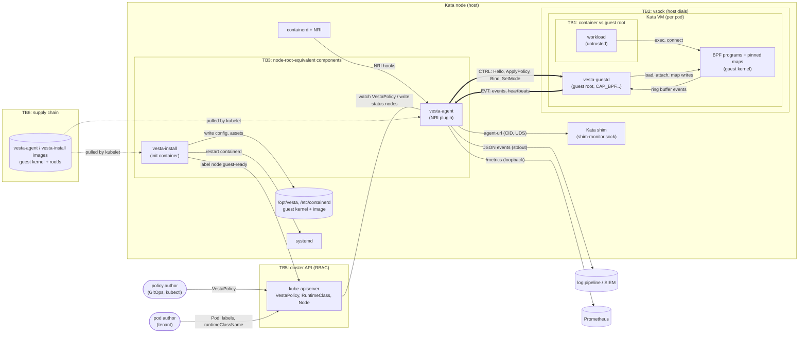

# Threat model (STRIDE)

This is a STRIDE threat model of vesta as it is implemented today. It covers the Helm chart, vesta-install, vesta-agent, the vsock channel, vesta-guestd, the BPF programs, the VestaPolicy API and the supply chain. Each threat lists the mitigations already in the code, the residual risk, and what to do about it. The design-level threat model this builds on is [ARCHITECTURE §1.4](ARCHITECTURE.md#14-threat-model-and-trust-boundaries-vesta).
{: .fs-5 .fw-300 }

{: .note }
> Scope: the `main` branch on 2026-09-30, pre-release (Phase 0 to 2, see [Status](IMPLEMENTATION_STATUS.md)). Standard Kata only. Confidential Containers, where the host is untrusted, is out of scope, as the architecture states. Re-review this page when the channel protocol, the chart's privileges or the policy semantics change.

## Summary

vesta adds a security control inside each Kata VM. Its two host components are, by necessity, **node-root-equivalent**: vesta-install writes containerd's configuration and can restart units through systemd, and vesta-agent holds the NRI socket, which lets a plugin modify any container on the node. The design keeps the untrusted side (the workload and the guest) away from those components. The guest can only answer requests over framed, size-limited, validated protobuf; it never selects host actions, paths or metric labels.

The most important open risks:

| # | Risk | Rating | Section |
|---|---|---|---|
| 1 | A workload with guest root (privileged or `CAP_BPF`/`CAP_SYS_ADMIN` Kata pod) can detach or rewrite vesta's BPF programs and maps; self-protection programs are not implemented yet | **High** | [T-G1](#tampering) |
| 2 | Pod authors choose labels and RuntimeClass, so they can opt out of a strict policy or out of vesta entirely; there is no non-overridable baseline (`ClusterVestaPolicy`) | **High** | [E-P1, E-P2](#elevation-of-privilege) |
| 3 | Anyone who can write VestaPolicy in a namespace can weaken it: a more specific Audit policy wins over an Enforce one | **High** | [T-P1](#tampering) |
| 4 | Compromise of the vesta-agent or vesta-install image is node compromise; images are not signed and the chart does not require digests | **High** | [E-H1, T-S1](#elevation-of-privilege) |
| 5 | Exec events carry full argv, which can contain secrets, into the log pipeline with no redaction option | **Medium** | [I-E1](#information-disclosure) |
| 6 | NRI serialises all plugins node-wide, so a stalled vesta hook delays every pod start on the node (bounded by the 1.5 s gate) | **Medium** | [D-H2](#denial-of-service) |
| 7 | Every guest receives the whole cluster-wide policy set, so guest root in one tenant's pod can read other tenants' rules | **Medium** | [I-X1](#information-disclosure) |

## Method

- **STRIDE per element** over the data-flow diagram below: each process, data store, data flow and external entity is checked for **S**poofing, **T**ampering, **R**epudiation, **I**nformation disclosure, **D**enial of service and **E**levation of privilege.
- **Rating:** likelihood (how reachable, how much skill) x impact (what an attacker gains), each Low/Medium/High, combined into the overall rating. "Mitigated" means no known residual risk beyond the stated assumptions.
- **Status:** *Mitigated*, *Partial* (residual risk accepted or pending), *Open* (no mitigation yet).
- Mitigations cite the code or chart that implements them, so they can be re-checked.

## System and data flows

### Trust boundaries

| ID | Boundary | Crossing |
|---|---|---|
| TB1 | Workload container ↔ guest kernel and guest root | syscalls (exec, connect, bpf) from the untrusted workload |
| TB2 | Guest ↔ host | vsock CTRL/EVT; guest data reaches vesta-agent |
| TB3 | vesta host components ↔ the rest of the node | NRI socket, containerd config, systemd socket, Kata shim sockets |
| TB4 | Node ↔ API server | installer token (node label), agent token (policies, status) |
| TB5 | Users ↔ API server | VestaPolicy authors, pod authors (labels, RuntimeClass) |
| TB6 | Build and registry ↔ cluster | images, guest kernel, rootfs, BPF objects |
| TB7 | vesta-agent ↔ observability consumers | event stream, metrics endpoint |

### Assets

| Asset | Why it matters |
|---|---|
| Node integrity | Both host components can take over the node; so can anyone who controls them |
| Isolation between sandboxes | A tenant's events, policy or availability must not be affected by another sandbox |
| Policy integrity (desired and in force) | The control's whole value: what is audited or denied in each sandbox |
| Event integrity and completeness | Detection, forensics and audit depend on it |
| Event confidentiality | argv, paths and destinations can reveal secrets and tenant activity |
| Availability of pod starts | vesta sits in the container start path (NRI gate) |
| Supply-chain artifacts | Images and guest artifacts run as node root or as the guest kernel |

### Actors

| Actor | Capability assumed |
|---|---|
| **A1 Workload** | Arbitrary code in a sandboxed container; may reach guest root if the pod is privileged or has broad capabilities |
| **A2 Tenant** | Can create pods (and, depending on RBAC, VestaPolicy objects) in its namespaces |
| **A3 Compromised node component** | Controls one node's kubelet, containerd, or a vesta host component |
| **A4 Cluster admin** | Trusted; installs the chart, sets the kill switch |
| **A5 Supply-chain attacker** | Can influence a dependency, base image, registry or build |
| **A6 Network attacker** | On the node network or pod network |

### Assumptions and non-goals

- The host kernel, KVM, the hypervisor and Kata's shim and agent are trusted; an escape from the Kata VM is out of scope.
- A guest kernel exploit defeats in-guest enforcement. vesta aims to be tamper-evident there, not tamper-proof ([ARCHITECTURE §1.4.2](ARCHITECTURE.md#142-tamper-resistance-inside-the-guest-a1-gets-guest-root)).
- Cluster admins (A4) are trusted; RBAC for VestaPolicy is set up by them.
- Confidential Containers (untrusted host) is not supported.

## Threats

Status: **M** mitigated, **P** partial, **O** open. Rating: H/M/L.

### Spoofing

| ID | Element | Threat | Existing mitigation | Rating | Status | Recommendation |
|---|---|---|---|---|---|---|
| S-G1 | guestd CTRL/EVT listener | A process inside the guest (workload) connects to guestd's vsock ports and poses as the host: pushes policy, reads events | guestd accepts only peer CID 2, the host (`allowed_peer_cid`, guest/vesta-guestd/src/server.rs); loopback vsock from the guest is refused | L | M | Keep a test that a non-host CID is rejected |
| S-H1 | agent → guest dial | The agent is tricked into dialing the wrong VM (another tenant's) and binding policy there | The endpoint comes from the Kata shim's `/agent-url` for that sandbox id; the sandbox id is regex-validated before any socket path is built (host/internal/transport) | L | M | None |
| S-E1 | event attribution | A compromised guest forges pod, namespace or container names to frame another workload | Host enrichment comes only from NRI and the sandbox's own container table; a guest-supplied `Host` block is discarded; lookups never cross sandboxes (host/internal/events) | L | M | Document which attributes are guest-asserted ([Reference](reference/protocol.md)) |
| S-E2 | event content | A compromised guest (guest root, A1) forges or suppresses exec/connect events (process names, argv, paths) | Guest-asserted fields are marked as such; seq gaps and heartbeat anomalies raise alerts; enforcement does not depend on events | M | P | Treat events from a sandbox with a tamper alert as untrusted; correlate with host-side network telemetry |
| S-P1 | pod identity for policy selection | A tenant labels a pod to impersonate an exempt workload and get a weaker policy | Selection is namespace-scoped: a policy only applies in its own namespace | M | P | See E-P1: namespace-wide baseline policies (`selector: {}`) |
| S-K1 | status writes | A compromised node writes another node's `status.nodes` entry | ValidatingAdmissionPolicy limits the agent's status writes to the entry of the node its token is bound to (deploy/helm/vesta/templates/policy-status-policy.yaml; checked by `make crd-check`) | L | M | None; a node can still misreport its own entry (R-K1) |

### Tampering

| ID | Element | Threat | Existing mitigation | Rating | Status | Recommendation |
|---|---|---|---|---|---|---|
| T-G1 | BPF programs and maps (guest) | A1 with guest root (privileged Kata pod, or `CAP_BPF`/`CAP_SYS_ADMIN`/`CAP_PERFMON`) detaches links, unpins programs, or rewrites `cgroup_policy`/rule maps, disabling enforcement for its sandbox | Unprivileged BPF off (`CONFIG_BPF_UNPRIV_DEFAULT_OFF`), no kernel modules, `lockdown=integrity`; default container capabilities exclude BPF/admin; config map frozen; heartbeats carry program tags and link ids, and the agent alerts on changes and gaps. **Missing:** the self-protection programs (`lsm/bpf`, `lsm/bpf_map`, `lsm/task_kill`, ...; ARCHITECTURE group T, Phase 3) | **H** (if privileged pods are allowed) | **O** | Forbid privileged pods and `CAP_BPF`/`CAP_SYS_ADMIN`/`CAP_PERFMON`/`CAP_SYS_PTRACE` for `kata-qemu-vesta` pods with an admission policy (ship it in the chart); implement the Phase 3 self-protection programs; alert on map-content drift (hash in heartbeat) |
| T-G2 | guestd process | A1 with guest root kills or ptraces guestd | Pinned links keep enforcing; heartbeats stop and the agent marks the sandbox `unmonitored` and alerts; guestd restarts under systemd and re-adopts state without lowering the generation | M | P | Phase 3 `lsm/task_kill`, `lsm/ptrace_access_check` protection |
| T-P1 | VestaPolicy objects | Anyone with write access to VestaPolicy in a namespace weakens enforcement: edits the policy, deletes it, or adds a more specific Audit policy (`containerSelector` wins over pod-wide) | Kubernetes RBAC; per-node status shows what is in force; hot reload makes every change effective quickly, including bad ones | **H** (with default RBAC delegation) | **O** | Grant VestaPolicy write only to the security team or GitOps service account; add `ClusterVestaPolicy` with a non-overridable baseline and "most restrictive wins" semantics; admission rule that an Enforce policy cannot be shadowed by an Audit one |
| T-H1 | channel messages (guest → host) | A compromised guest sends malformed or oversized frames to corrupt agent state | Length prefix checked before allocation (1 MiB cap), read deadlines, protobuf decode, enum and length validation of every field, per-sandbox rate limits and bounded queues (host/internal/wire, host/internal/sandbox/validate.go) | L | M | Add fuzz tests for the Go decoder and validators (planned test work) |
| T-H2 | node filesystem (installer) | A symlink or race under the host root redirects installer writes (for example into `/etc`) | Every path component opened with `O_NOFOLLOW`, temp file + fsync + rename, SHA-256 check before the rename, refuses hosts where `/opt` is a symlink (host/internal/hostfs, install) | L | M | None |
| T-H3 | containerd config | A bad drop-in breaks containerd on the node | The generated config is re-parsed and checked; on a failed restart the previous config is restored and containerd restarted again | L | M | Stage rollouts (`updateStrategy.maxUnavailable: 1`), watch node readiness |
| T-S1 | images and guest artifacts (TB6) | A5 swaps the vesta-install image or the guest kernel/rootfs it carries; the installer then places attacker code as the guest kernel or registers it with containerd | Base images pinned by digest, actions pinned by SHA, Dependabot, govulncheck; the installer checks SHA256SUMS, but they ship in the same image (integrity, not authenticity) | **H** impact, M likelihood | **P** | Sign images and guest artifacts (cosign, keyless in CI) and verify at admission (sigstore policy-controller or Kyverno); require `image.digest` in production values; publish SBOM and SLSA provenance |
| T-N1 | Node labels | A compromised installer relabels other nodes or changes other labels | VAP: only `vesta.dev/guest-ready`, only on the token's own node, semver values only | L | M | None |

### Repudiation

| ID | Element | Threat | Existing mitigation | Rating | Status | Recommendation |
|---|---|---|---|---|---|---|
| R-E1 | event stream | A workload's actions leave no record because events were dropped (ring buffer full, channel down, host queue full) | Every drop is counted (ring buffer per type, channel, host queue) and exported as metrics; seq numbers are monotonic per guest boot and gaps are counted; enforcement does not depend on delivery | M | P | Alert on `vesta_ringbuf_drops_total`, `vesta_event_seq_gaps_total` and `vesta_events_dropped_total`; size the ring buffer per workload |
| R-E2 | timestamps | A compromised guest skews its clock to misplace events in time | Record time is the host receive time; the guest wall time is informational | L | M | None |
| R-P1 | policy changes | A policy was weakened and no one can tell who did it or when it was in force | Kubernetes audit log for VestaPolicy writes; per-node `observedGeneration` and `programmed` counts; events carry the policy name and generation | L | P | Enable API audit logging at `RequestResponse` for `vestapolicies`; keep policies in Git |
| R-K1 | per-node status | A compromised node reports its policies as programmed when they are not | Status is advisory; heartbeats from each guest carry the applied generation and policy hash | M | P | Cross-check status against event-borne policy generations centrally |

### Information disclosure

| ID | Element | Threat | Existing mitigation | Rating | Status | Recommendation |
|---|---|---|---|---|---|---|
| I-E1 | exec events | argv, paths and connection targets (tokens in command lines, internal hostnames) flow into logs readable by more people than the workload's owners | argv is truncated (256 entries, 4 KiB); argv capture can be switched off per guest image (`capture_argv` in `guestd.toml`); events go to stdout only | M | **P** | Add argv redaction rules (for example known token patterns) and a per-policy or host-side argv switch, so it does not need a new guest image; restrict log access per tenant in the log pipeline |
| I-M1 | metrics endpoint | `/metrics` exposes pod names and namespaces unauthenticated | Loopback only by default; node IP only when exposed; no guest strings as label values (no cardinality or injection) | L | M | If exposed, firewall the port or front it with kube-rbac-proxy |
| I-X1 | cross-sandbox | One tenant's events or policies leak to another tenant's sandbox | Per-sandbox sessions and state; events and enrichment never cross sandboxes. **But** `ApplyPolicy` sends the **whole cluster-wide policy set** to every guest (host/internal/sandbox/session.go, `set.Bundles()`), so guest root in one tenant's pod can read every namespace's rules: allowed binaries, CIDRs and ports | M | **O** | Send each guest only the policies of its own namespace (the only ones that can select its containers) |
| I-K1 | agent token | A compromised node reads all VestaPolicy objects cluster-wide | Token only with `policies.source: kubernetes`, read-only on vestapolicies, projected with 1 h expiry | L | P | Acceptable (policies are not secrets); keep secrets out of policies |

### Denial of service

| ID | Element | Threat | Existing mitigation | Rating | Status | Recommendation |
|---|---|---|---|---|---|---|
| D-G1 | agent event pipeline | A1 floods exec/connect to overwhelm the agent or starve other sandboxes | guestd evicts audited events before denied ones and bounds its replay buffer by heap size; per-sandbox EVT frame and heartbeat rate limits; bounded export queue with counted drops | M | M | Tune per-sandbox rate and burst to the node's sandbox count |
| D-H2 | NRI hooks | A slow or stalled guest delays container starts; NRI holds one lock across all plugins, so every pod start on the node waits | Gate timeout 1.5 s (below NRI's 2 s); CTRL writes from hooks are bound to the gate context; sandbox teardown is asynchronous | M | P | Measure hook latency (`vesta_gate_decisions_total` by result); consider moving the bind wait out of `CreateContainer` entirely |
| D-P1 | policy (self-inflicted) | A wrong Enforce + Closed policy blocks every exec or connect in selected pods | Audit-first default; per-node status; global kill switch (`AuditOnly`, `Detached`) | M | P | Require Audit soak time before Enforce in the GitOps workflow |
| D-H3 | containerd restarts | Installer restarts containerd on every node at install and upgrade | Restart only if the config changed; rollback on failure; DaemonSet rolls one node at a time | M | P | Install on new or drained nodes; document the k3s/RKE2 control-plane restart |
| D-A1 | agent down | Closed policies are bypassed or all vesta pods are blocked while the agent is not registered with NRI | containerd's NRI default validator plus the `required-plugins` annotation (opt-in VAP `nri.requirePluginAnnotation`); the sandbox default denies exec/connect in unbound cgroups | M | P | Enable `nri.requirePluginAnnotation` wherever `failurePolicy: Closed` is used |

### Elevation of privilege

| ID | Element | Threat | Existing mitigation | Rating | Status | Recommendation |
|---|---|---|---|---|---|---|
| E-H1 | vesta-agent (NRI plugin) | Code execution in vesta-agent (for example a parser bug reached from the guest) gives node root: NRI plugins can add mounts, devices and hooks to any container | Guest input is validated before use; Go memory safety; all capabilities dropped, read-only root filesystem, seccomp `Localhost` profile (containerd default + `AF_VSOCK`), no API token unless the Kubernetes source is used | **H** impact, L likelihood | P | Fuzz the channel decoders; consider splitting the vsock-facing session code into a separate, unprivileged process that does not hold the NRI socket |
| E-H2 | vesta-install | Code execution in the installer gives node root (containerd config, systemd private socket) | Runs only as an init container; no network input; capabilities dropped; paths confined; SHA-256 checked assets | **H** impact, L likelihood | P | Signed images (T-S1); optional mode without the systemd socket (operator restarts containerd) is already supported (`installer.restartContainerd=false`) |
| E-P1 | policy selection | A tenant avoids a strict policy by choosing pod labels that the policy does not select | Policies are namespace-scoped; `selector: {}` covers every pod in a namespace | **H** (if policies rely on labels) | **O** | Use namespace-wide selectors for baselines; add `ClusterVestaPolicy` with `namespaceSelector`; admission check that sandbox namespaces have a baseline policy |
| E-P2 | RuntimeClass | A tenant runs its pod with the stock `kata-qemu-runtime-rs` or plain runc instead of `kata-qemu-vesta` and escapes monitoring entirely | None in vesta | **H** (multi-tenant) | **O** | Ship an optional ValidatingAdmissionPolicy that requires `runtimeClassName: kata-qemu-vesta` in labelled sandbox namespaces |
| E-G1 | guest kernel | A1 exploits the guest kernel and gains ring 0 in the VM | Out of scope: it defeats in-guest enforcement; the VM boundary still protects the node; heartbeats and seq gaps may reveal tampering | H | Accepted | Keep the guest kernel current (Kata LTS bumps); small config (no modules); consider Kata's `kernel_params` hardening |
| E-G2 | guestd | A1 abuses guestd's privileges (CAP_BPF, CAP_PERFMON, CAP_NET_ADMIN, CAP_DAC_READ_SEARCH) through a bug in guestd's input handling | guestd takes input only from the host (CID 2); cgroup paths confined with `openat2(RESOLVE_BENEATH | NO_SYMLINKS | NO_XDEV)`; rootfs lookups `RESOLVE_IN_ROOT`; no `CAP_SYS_ADMIN`; systemd `SystemCallFilter`; Rust, no panics on untrusted input | L | M | None |

## Recommended actions

In priority order. Items marked *roadmap* are already planned in the [Status](IMPLEMENTATION_STATUS.md) page or the architecture.

1. **Close the opt-out paths (E-P1, E-P2, T-P1).** Ship admission policies with the chart that (a) require `runtimeClassName: kata-qemu-vesta` in designated sandbox namespaces and (b) reject privileged or `CAP_BPF`/`CAP_SYS_ADMIN`/`CAP_PERFMON` capabilities for those pods. Add `ClusterVestaPolicy` for non-overridable baselines, with "most restrictive wins" merging.
2. **Guest self-protection (T-G1, T-G2).** Implement the Phase 3 `lsm/bpf`, `lsm/bpf_map`, `lsm/bpf_prog`, `lsm/task_kill` and `lsm/ptrace_access_check` programs (*roadmap*). Add a map-content hash to heartbeats.
3. **Supply chain (T-S1, E-H2).** Sign images and guest artifacts in CI (cosign, keyless), publish SBOMs and SLSA provenance, and verify at admission; require digests in production values.
4. **Least data to each guest (I-X1).** Send each guest only the policies of its own namespace.
5. **Event confidentiality (I-E1).** Add argv redaction rules and an option to drop argv.
6. **Harden the agent's attack surface (E-H1, T-H1).** Fuzz the Go frame and event decoders; consider a privilege split between the vsock sessions and the NRI plugin.
7. **Operational controls.** Restrict VestaPolicy RBAC to the security team or GitOps, enable API audit logging for `vestapolicies`, alert on drops, seq gaps and tamper alerts, and enable `nri.requirePluginAnnotation` where Closed policies are used.
